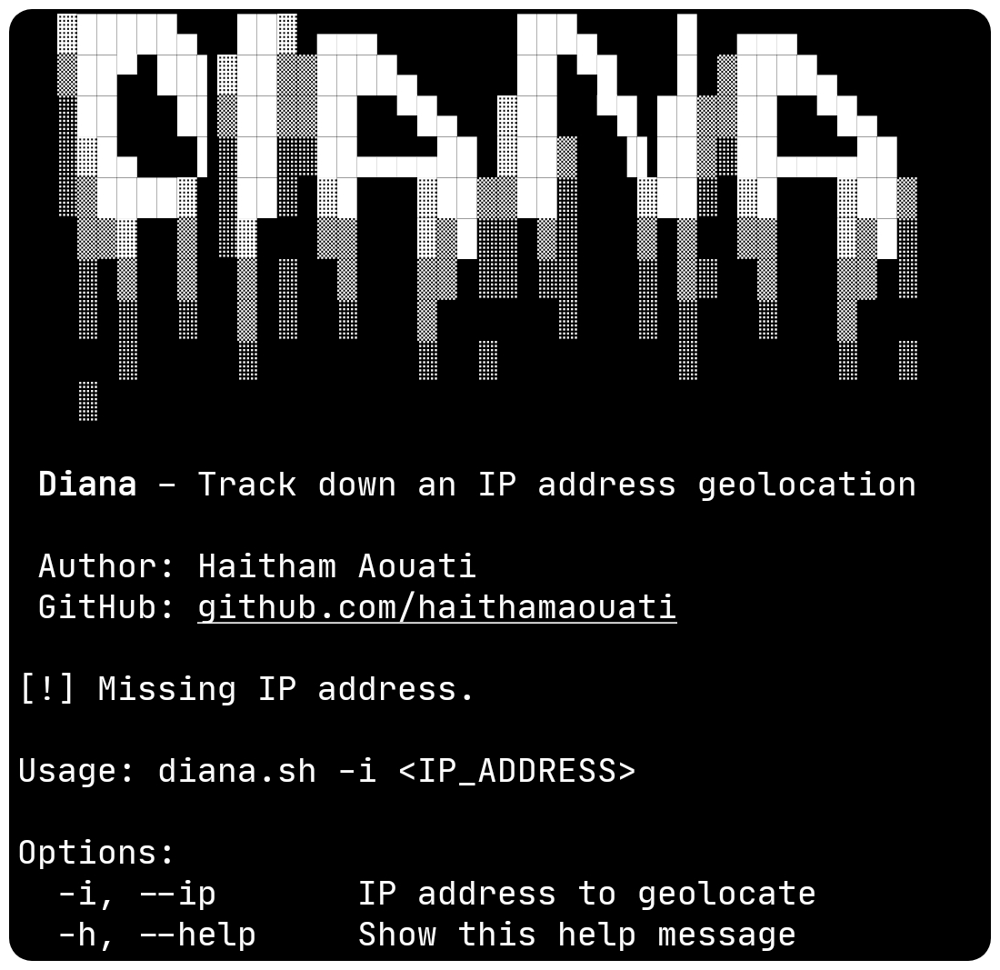

# Diana
Track down an IP address geolocation — fast, accurate, and reliable.



## Install

To use the Diana script, follow these steps:

1. Clone the repository:

    ```
    git clone https://github.com/haithamaouati/Diana.git
    ```

2. Change to the Diana directory:

    ```
    cd Diana
    ```
    
3. Change the file modes
    ```
    chmod +x diana.sh
    ```
    
5. Run the script:

    ```
    ./diana.sh
    ```
## Usage

Usage: `./diana.sh -i <IP_ADDRESS>`

##### Options:

`-i`, `--ip`       IP address to geolocate

`-h`, `--help`     Show this help message

## Dependencies

The script requires the following dependencies:

- [curl](https://curl.se/): `pkg install curl - y`
- [jq](https://stedolan.github.io/jq/): `pkg install jq -y`

Make sure to install these dependencies before running the script.

## Author

Made with :coffee: by **Haitham Aouati**
  - GitHub: [github.com/haithamaouati](https://github.com/haithamaouati)

## License

Diana is licensed under [WTFPL license](LICENSE).
